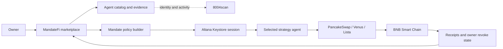

# MandateFi

> Discover, compare, and activate autonomous DeFi agents with bounded permissions.

[](https://www.bnbchain.org/en/hackathons/smart-money-era)
[](#build-status)
[](LICENSE)

MandateFi is an agent marketplace for the **BNB Chain Smart Money Era Hackathon**. It helps a user move through the full decision journey: discover an agent, understand its evidence, compare alternatives, and grant only the authority that agent needs.

**Prototype:** https://feeeeelixwong.github.io/mandatefi/

> **Data notice:** strategy outcomes remain clearly labeled scenario data. Wallet/network state and the ERC-8004 registry strip are live. Strategy transactions and Altana sessions remain integration milestones, not completed claims.

## ✦ Product Journey

1. **Discover** agents across all four required strategy categories.
2. **Understand** outcomes, risk, cost, protocols, and safeguards.
3. **Compare** up to three agents with a consistent metric model.
4. **Activate** a mandate with a capital cap, contract allowlist, and expiry.
5. **Control** active mandates from one place and revoke them at any time.

## ◫ Marketplace Coverage

| Category | User job | Example agents | Evidence model |
| --- | --- | --- | --- |
| Rebalancing | Keep LP capital productive | Range Pilot, Delta Range | Range uptime, fee uplift, drawdown |
| Grid Trading | Automate bounded grid execution | Grid Smith, Calm Grid | Net return, win rate, profit factor |
| Yield Optimisation | Route capital by net yield | Yield Scout, Carry Router | Net APY, uplift, move frequency |
| Health Factor | Prevent avoidable liquidations | Health Guard, Buffer Watch | Response time, false actions, avoided liquidations |

## ◎ Owner-Controlled Activation

Every activation is expressed as a revocable mandate:

```text
Agent identity + capital cap + contract allowlist + expiry + owner revoke
```

The target integration uses an Altana session key registered in the Keystore. The agent never receives the owner's private key and cannot call contracts outside the mandate.

## ⑂ Architecture



See [the integration plan](docs/INTEGRATION_PLAN.md) for contract and API boundaries.

## 🏁 Track Alignment

| Track | MandateFi contribution | Proof required before submission |
| --- | --- | --- |
| Main Agent Marketplace | Four equally deep categories and a discover-to-activate journey | Live catalog data and working activation |
| Altana | Agent-owned wallet with spend cap, allowlist, expiry, and revoke | Keystore registration and real session-key transaction |
| TermiX | Marketplace that helps users select agents by value | Completed [Agent Advantage Report](docs/AGENT_ADVANTAGE_REPORT.md) |
| PancakeSwap | Rebalancing and grid agents tied to trader/LP outcomes | Real Testnet execution or verifiable simulation |

## Build Status

| Capability | Status |
| --- | --- |
| Four-category marketplace | ✅ Functional |
| Search, filtering, and comparison | ✅ Functional |
| Mandate setup and revoke UX | ✅ Functional prototype |
| Responsive desktop/mobile UI | ✅ Functional |
| Injected wallet + BSC Testnet guard | ✅ Live |
| tBNB balance read | ✅ Live |
| 8004scan identity API | ✅ Live read-only |
| BNB Agent Studio agent runtime | ⏳ Next |
| Altana Keystore session | ⏳ Next |
| BSC Testnet execution evidence | ⏳ Next |
| Advantage Report measurements | ⏳ Template ready |

The UI keeps live identity data visually separate from the simulated strategy catalog so evaluators can identify which claims are currently backed by external systems. The live integration is implemented in `src/hooks/useInjectedWallet.ts` and `src/services/erc8004.ts`.

Official references: [BNB wallet configuration](https://docs.bnbchain.org/bnb-smart-chain/developers/wallet-configuration/) and [8004scan Builder Hub](https://8004scan.io/developers).

## Run Locally

```bash
npm install
npm run dev
```

Quality checks:

```bash
npm run lint
npm run build
```

## Integration Note

The official `@bnbagent/studio-cli@0.0.12` package currently declares `commander@^15.0.0`, while that dependency is not available from the public npm registry at the time of this build. The product shell therefore stays SDK-ready and does not claim a successful CLI installation. Direct integrations can proceed while the upstream package is corrected.

## License

[MIT](LICENSE)
