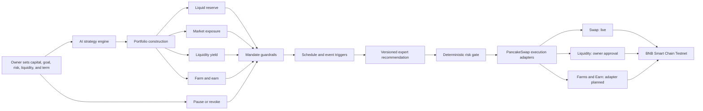

# MandateFi

> An owner-controlled AI DeFi portfolio manager for PancakeSwap.

[](https://www.bnbchain.org/en/hackathons/smart-money-era)
[](#execution-coverage)
[](LICENSE)

**Live product:** https://feeeeelixwong.github.io/mandatefi/

MandateFi lets an owner assign capital, choose an outcome, set risk and liquidity preferences, and approve a revocable mandate. Its strategy engine then constructs a portfolio across four sleeves: liquid reserve, market exposure, liquidity yield, and farm/earn positions.

PancakeSwap is the execution venue, not the strategy itself. A simple tBNB/BUSD Swap is the first live adapter used to prove scoped execution on BSC Testnet. Liquidity, Farms, and Earn are represented as separate strategy actions with honest coverage labels until their adapters are complete.

## Product Logic



The engine does not merely wait for one BNB/BUSD ratio to cross a band. It:

1. Converts the owner's preferences into a four-sleeve allocation.
2. Applies hard limits for liquid reserve, LP exposure, position size, slippage, impermanent loss, turnover, expiry, and leverage.
3. Builds an ordered action queue across the relevant PancakeSwap modules.
4. Scans lightweight triggers every minute and runs a full review only for schedule, drift, risk, cash-flow, expiry, or owner events.
5. Produces a versioned, schema-validated expert recommendation before the deterministic risk gate.
6. Executes only through a completed adapter and only inside the approved mandate.
7. Holds, defers, blocks, or requests approval when an action is unnecessary, cooling down, unsupported, or outside policy.

## Strategy Sleeves

| Sleeve | Purpose | PancakeSwap tool | Example inputs |
| --- | --- | --- | --- |
| Liquid reserve | Withdrawals, gas, and defensive reallocation | Swap | Stable allocation, withdrawal need, gas reserve |
| Market exposure | Diversified spot exposure | Swap | Asset approval, volatility, slippage, position cap |
| Liquidity yield | Fee-generating LP positions | Infinity Liquidity | Depth, volume, range, fee tier, impermanent-loss limit |
| Farm and earn | Incentives and single-token yield | Farms and Earn | Emissions, lock terms, exit liquidity, gas-adjusted return |

The strategy model is deterministic for the same inputs. The displayed model APY is a scenario estimate used for comparison, not a live quote or guaranteed return.

## Example Allocations

| Profile | Liquid reserve | Market exposure | Liquidity yield | Farm and earn |
| --- | ---: | ---: | ---: | ---: |
| Conservative | 50% | 15% | 20% | 15% |
| Balanced | 25% | 30% | 30% | 15% |
| Growth | 10% | 45% | 35% | 10% |

Goal, liquidity access, and time horizon adjust these baselines. Every result is normalized to 100% and rechecked against the selected profile's limits.

## Owner Guardrails

The strategy cannot loosen its own permissions. Depending on the selected profile, MandateFi enforces:

- a minimum liquid reserve;
- maximum total LP exposure;
- maximum single-position size;
- slippage and impermanent-loss limits;
- a daily turnover cap;
- an owner-selected expiry;
- no leverage;
- owner approval for actions without a live autonomous adapter.

The live Altana session currently permits only the reviewed PancakeSwap V2 Swap methods and BUSD approval required by that execution path. Assets remain in the passkey-controlled smart wallet, and the owner can revoke the session onchain.

## Execution Coverage

| Capability | Coverage | What this build proves |
| --- | --- | --- |
| AI strategy composition | **Live** | Generates four-sleeve allocations, actions, model risk, and guardrails |
| Expert prompt and trigger orchestration | **Live with deterministic fallback** | Uses a versioned prompt contract, typed response schema, event triggers, action cooldowns, and a deterministic execution gate |
| PancakeSwap quote and bounded Swap | **Live on BSC Testnet** | Reads balances and quotes, calculates minimum output, and executes through a scoped Altana session |
| Infinity liquidity position | **Owner approval required** | Strategy sizing and risk gates are visible; autonomous adapter is intentionally not claimed |
| Farms position | **Adapter planned** | Eligibility and policy inputs are modeled; no live staking claim |
| Earn and reward compounding | **Adapter planned** | Gas threshold and schedule are modeled; no live compounding claim |
| Pause and onchain revoke | **Live** | Owner can stop the local runtime or revoke the scoped session |

This separation is deliberate: the UI shows the intended full product without presenting planned integrations as already operational.

## Two-Layer Safety Model

| Layer | Enforces | Cannot do |
| --- | --- | --- |
| Strategy and policy engine | Allocation, action ordering, reserve, LP, position, slippage, IL, turnover, and approval limits | Sign, broadcast, or expand authority |
| Altana session policy | Allowed contracts, allowed methods, spend caps, expiry, and revoke | Access the owner passkey or call an unapproved target |

## Public BSC Testnet Evidence

| Evidence | Result | Explorer |
| --- | --- | --- |
| Altana smart wallet | `0x2cd25c624f1a9e75c2991db6f8636f712c38914a` | [View wallet](https://testnet.bscscan.com/address/0x2cd25c624f1a9e75c2991db6f8636f712c38914a) |
| Test-gas funding | `0.01 tBNB` confirmed | [View transaction](https://testnet.bscscan.com/tx/0xd06ce74431c7b33c1d8299e1c073f39da727fde034f56841862e103631ffc70b) |
| Passkey admin and scoped session grant | Confirmed in Altana KeyStore | [View transaction](https://testnet.bscscan.com/tx/0x726ed597395ef065e84ac93c1cbbbbadbed6680f690e77c12c86e440cdb7e263) |
| Session-key verification execution | Confirmed | [View transaction](https://testnet.bscscan.com/tx/0xfd00b2341d4366840f0125ba0279c50ef0aaf8d7f522d9658332fdf14cf5dc3a) |

These receipts prove the wallet and scoped-session lifecycle. A new owner-authorized Swap receipt for this exact build remains an operator step and is not represented as already completed.

## Architecture Boundaries

- `src/domain/strategy.ts` builds the multi-sleeve strategy and hard guardrails.
- `src/domain/portfolio.ts` evaluates the currently live liquid-reserve Swap path.
- `src/domain/triggerEngine.ts` decides when schedule, drift, risk, cash-flow, expiry, or owner events justify a review.
- `src/domain/assetManagerPrompt.ts` defines the versioned expert role and strict typed recommendation schema.
- `src/domain/strategyOrchestrator.ts` applies deterministic fallback judgment and the adapter-aware execution gate.
- `src/integrations/altana.ts` reads balances and quotes, builds permissions, grants sessions, executes, and revokes.
- `src/hooks/useAltanaWallet.ts` manages the passkey wallet lifecycle and safe UI states.
- `src/App.tsx` provides portfolio, strategy creation, activity, and guardrail journeys.

The hackathon deployment is a static browser app. The scoped session signer stays only in memory, and the local evaluator runs while the tab is active. A production deployment would move the same deterministic engine to a secure always-on executor without broadening the owner-approved policy.

See [the AI strategy runtime](docs/AI_STRATEGY.md), [the production integration plan](docs/INTEGRATION_PLAN.md), and [the BSC Testnet runbook](docs/ALTANA_RUNBOOK.md).

## Run Locally

```bash
npm install
npm run dev
```

Quality checks:

```bash
npm run lint
npm test
npm run build
```

## License

[MIT](LICENSE)
