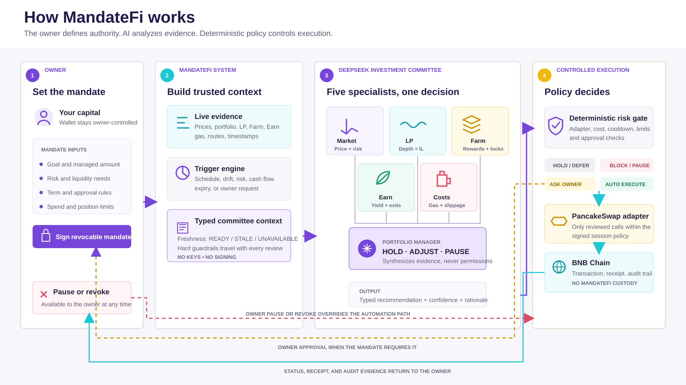

# MandateFi

> An owner-controlled AI DeFi portfolio manager for PancakeSwap.

[](https://www.bnbchain.org/en/hackathons/smart-money-era)
[](#execution-coverage)
[](LICENSE)

**Live product:** https://mandatefi-ten.vercel.app/

MandateFi lets an owner enter a tBNB funding amount, set risk and liquidity preferences, and approve a revocable mandate for an owner-controlled Passkey smart account. Before any wallet permission is requested, a dedicated allocation agent compares USDT and USDC using current yield, TVL, peg stability, eligible PancakeSwap opportunities, and live execution quotes. The owner reviews that evidence; an owner-signed PancakeSwap transaction then converts funded tBNB above a protected `0.003 tBNB` Gas reserve into the AI-selected stablecoin. The strategy engine constructs a portfolio across four sleeves: liquid reserve, market exposure, liquidity yield, and farm/earn positions.

PancakeSwap is the execution venue, not the strategy itself. Stablecoin-to-tBNB and tBNB-to-stablecoin swaps are the first live adapters used to prove scoped execution on BSC Testnet. Liquidity, Farms, and Earn are represented as separate strategy actions with honest coverage labels until their adapters are complete.

## Product Structure



- **Owner:** manually enters a tBNB funding amount and defines goals, risk, liquidity, term, and approval boundaries. The UI provides no preset deposit amounts or fixed maximum; wallet balance and the live route determine executable size.
- **MandateFi system:** gathers timestamped evidence, detects review triggers, validates model outputs, and applies the deterministic policy gate.
- **AI allocation agent:** compares USDT and USDC before activation and produces a typed choice, confidence, rationale, and evidence record.
- **AI committee:** five independent specialists analyze separate evidence domains; the portfolio manager synthesizes a typed recommendation but cannot sign or expand authority.
- **Execution layer:** only the AI-selected stablecoin reviewed by the owner, its PancakeSwap router, and methods inside the signed mandate can execute; receipts and audit evidence return to the owner.

## Funds and Custody

MandateFi is not a pooled vault and the Vercel backend never receives assets or signing keys.

1. The user connects an EOA only to create and fund their own Passkey smart account with tBNB.
2. The allocation agent ranks USDT and USDC from timestamped opportunity, peg, liquidity, and execution evidence. This recommendation grants no wallet authority.
3. After owner review, the owner Passkey converts all account tBNB above the `0.003 tBNB` Gas target into the recommended stablecoin. This startup conversion occurs before the AI session exists.
4. The owner Passkey grants a separate, expiring Altana session limited to that token, router, methods, daily caps, and mandate term.
5. DeepSeek returns typed recommendations only. A deterministic gate decides whether a reviewed adapter may execute.
6. If native Gas later falls below `0.0015 tBNB`, the engine proposes a capped stablecoin-to-tBNB route that restores the target reserve. It is labelled `GAS_TOP_UP` and recorded separately from portfolio rebalancing.
7. Every stablecoin choice, startup conversion, portfolio swap, and Gas refill records its evidence or transaction result in **Activity**.
8. The owner can pause locally, revoke the session onchain, or use **Exit assets** to revoke first and return stablecoins plus excess Gas to the connected owner wallet.

The current hackathon build uses BSC Testnet assets. A production release still requires audited smart-account recovery, an audited stablecoin adapter, stronger argument-level allowance constraints or Permit2, monitoring, and an emergency operations policy.

## Product Logic

The engine does not merely wait for one token ratio to cross a band. It:

1. Ranks USDT and USDC for the owner's mandate using risk-adjusted opportunity, peg, liquidity, and live route evidence.
2. Normalizes owner-funded tBNB into the AI-selected stablecoin while protecting a dedicated Gas reserve.
3. Converts the owner's preferences into a four-sleeve allocation.
4. Applies hard limits for liquid reserve, LP exposure, position size, slippage, impermanent loss, turnover, Gas, expiry, and leverage.
5. Builds an ordered action queue across the relevant PancakeSwap modules.
6. Scans lightweight triggers every minute and runs a full review only for schedule, Gas level, drift, risk, cash-flow, expiry, or owner events.
7. Calls five independent DeepSeek specialist agents in parallel, each with its own role prompt and explicit `READY`, `STALE`, or `UNAVAILABLE` evidence state.
8. Prices the proposed action with live BSC gas and PancakeSwap route quotes before the portfolio manager can recommend execution.
9. Sends the five reports to a separate DeepSeek portfolio-manager agent and validates its strict JSON recommendation before the deterministic risk gate.
10. Executes only through a completed adapter and only inside the approved mandate.
11. Holds, defers, blocks, or requests approval when an action is unnecessary, costly, cooling down, unsupported, or outside policy. A bounded Gas refill bypasses the portfolio cooldown because it restores execution safety rather than taking a new investment view.

## Investment Committee

| Specialist | Cadence | Decision evidence |
| --- | ---: | --- |
| Market analyst | 5 minutes | Official BNB, CAKE, USDT and USDC prices, testnet execution quote, balances, reserve drift and depeg state |
| LP analyst | 10 minutes | Pool depth, fee APR, range health and impermanent loss |
| Farm analyst | 30 minutes | Net incentives, emissions decay, locks and exit liquidity |
| Earn analyst | 60 minutes | Vault APY, accrued rewards, compounding threshold and withdrawal terms |
| Execution cost analyst | Per action / 1 minute | Live gas, slippage reserve, route price impact and exit friction |

Each specialist is a separate DeepSeek request, and the portfolio manager is a sixth request that acts as committee chair. It may aggregate the reports, but it cannot silently replace missing evidence. The Market agent reads BNB, CAKE, USDT, and USDC USD prices through the official [PancakeSwap Price API SDK](https://developer.pancakeswap.finance/sdks/price-api-sdk); a missing or older-than-five-minute snapshot fails the autonomous execution gate closed. LP, Farm, and Earn agents rank verified mainnet opportunities from a scheduled PancakeSwap research snapshot. The execution-cost agent separately reviews BSC gas and route costs for an actionable testnet Swap. Research data never grants transaction authority.

The Vercel backend keeps the DeepSeek key server-side, validates every model response with Zod, hashes every input, and records the model, prompt version, run ID, and final output. If one specialist fails, only that report falls back to the deterministic engine. If the manager fails, the complete review safely falls back without broadening execution authority.

### Production Evidence

| Check | Verified result |
| --- | --- |
| Live product | [mandatefi-ten.vercel.app](https://mandatefi-ten.vercel.app) |
| Runtime health | [`deepseekConfigured: true`](https://mandatefi-ten.vercel.app/api/health) with `deepseek-v4-flash` specialists and a `deepseek-v4-pro` manager |
| Official market feed | [Live PancakeSwap Price API response](https://mandatefi-ten.vercel.app/api/market/prices) for BNB, CAKE, USDT, and USDC on BNB Chain mainnet |
| Full model smoke | Run `dead2ca4-d1c0-480f-b712-3f81d6acb99e` completed with all five specialist reports and the manager in `DEEPSEEK` mode |
| Safety outcome | The smoke review returned `HOLD` because LP, Farm, Earn, and execution-cost evidence was unavailable; the models did not invent yield or bypass the deterministic cost gate |

The production boundary accepts either a `0-1` probability or a `0-100` percentage from a model and normalizes it to an integer percentage before validation. This keeps minor JSON-format variation from silently downgrading an otherwise valid specialist report while preserving strict enums, field limits, and policy checks.

### PancakeSwap Research Plane

The deploy workflow refreshes `public/data/pancake-research.json` every 15 minutes because PancakeSwap Explorer does not expose a browser-CORS endpoint. The refresh job:

1. Queries official PancakeSwap Explorer data for an address-allowlisted token universe.
2. Rejects pools below the minimum TVL threshold.
3. Verifies active Farm PIDs and CAKE emissions against MasterChef V3 on BNB Chain mainnet.
4. Verifies the active CAKE-to-USDT Syrup Pool configuration and onchain stake balance.
5. Publishes a timestamped, schema-validated snapshot with source links.
6. Selects candidates conservatively by the owner's risk profile, liquidity, token quality, and observed yield.

Displayed APRs are short-window annualized observations, not forecasts or guaranteed returns. Before any future LP, Farm, or Earn execution, MandateFi must revalidate pool state and execution costs on the execution network.

## Strategy Sleeves

| Sleeve | Purpose | PancakeSwap tool | Example inputs |
| --- | --- | --- | --- |
| Liquid reserve | Withdrawals and defensive reallocation | Swap | Stable allocation and withdrawal need |
| Market exposure | Diversified spot exposure | Swap | Asset approval, volatility, slippage, position cap |
| Liquidity yield | Fee-generating LP positions | Infinity Liquidity | Depth, volume, range, fee tier, impermanent-loss limit |
| Farm and earn | Incentives and single-token yield | Farms and Earn | Emissions, lock terms, exit liquidity, gas-adjusted return |

The strategy model is deterministic for the same inputs. The displayed model APY is a scenario estimate used for comparison, not a live quote or guaranteed return.

## Example Allocations

| Profile | Liquid reserve | Market exposure | Liquidity yield | Farm and earn |
| --- | ---: | ---: | ---: | ---: |
| Conservative | 50% | 15% | 20% | 15% |
| Balanced | 25% | 30% | 30% | 15% |
| Growth | 10% | 45% | 35% | 10% |

Goal, liquidity access, and time horizon adjust these baselines. Every result is normalized to 100% and rechecked against the selected profile's limits.

## Owner Guardrails

The strategy cannot loosen its own permissions. Depending on the selected profile, MandateFi enforces:

- a minimum liquid reserve;
- maximum total LP exposure;
- maximum single-position size;
- slippage and impermanent-loss limits;
- a daily turnover cap;
- a `0.003 tBNB` Gas target and `0.0015 tBNB` low-watermark trigger;
- a risk-profile execution-cost ceiling and minimum net-benefit hurdle;
- an owner-selected expiry;
- no leverage;
- owner approval for actions without a live autonomous adapter.

The live Altana session permits only the reviewed PancakeSwap V2 Swap methods, the AI-selected USDT or USDC approval reviewed by the owner, risk-derived daily caps, and the selected expiry. The allocation agent cannot add another token or broaden permissions. Assets remain in the Passkey-controlled smart account. The owner can revoke the session onchain and return assets with the owner Passkey path.

## Execution Coverage

| Capability | Coverage | What this build proves |
| --- | --- | --- |
| AI strategy composition | **Live** | Generates four-sleeve allocations, actions, model risk, and guardrails |
| AI stablecoin allocation | **Live through DeepSeek with deterministic fallback** | Compares USDT and USDC yield, TVL, peg deviation, eligible opportunities, and live testnet normalization quotes before permission is requested |
| Multi-agent investment committee | **Live through DeepSeek on Vercel** | Runs five parallel specialist prompts; LP, Farm, and Earn use timestamped official PancakeSwap evidence |
| Portfolio-manager orchestration | **Live through DeepSeek with safe fallback** | Runs a sixth manager prompt, validates strict JSON, and retains event triggers, cooldowns, and a deterministic execution gate |
| tBNB funding normalization | **Live owner-signed path on BSC Testnet** | Converts a manually entered tBNB amount above the protected Gas target into the AI-selected USDT/USDC after owner review and before any AI authority is granted |
| PancakeSwap quote, bounded Swap, and Gas refill | **Live on BSC Testnet** | Reads selected USDT/USDC and tBNB Gas balances, distinguishes `PORTFOLIO_REBALANCE` from `GAS_TOP_UP`, calculates minimum output, and executes through a scoped Altana session |
| Infinity liquidity position | **Research live; owner approval required** | Mainnet pools are ranked; autonomous liquidity execution is intentionally not claimed |
| Farms position | **Research live; adapter planned** | Active MasterChef PIDs and emissions are verified; no live staking claim |
| Earn and reward compounding | **Research live; adapter planned** | Active Syrup Pool yield and TVL are verified; no live compounding claim |
| Pause, onchain revoke, and owner exit | **Live** | Owner can stop the local runtime, revoke the scoped session, and return stablecoin principal plus excess Gas |

This separation is deliberate: the UI shows the intended full product without presenting planned integrations as already operational.

## Two-Layer Safety Model

| Layer | Enforces | Cannot do |
| --- | --- | --- |
| Strategy and policy engine | Allocation, action ordering, reserve, LP, position, slippage, IL, turnover, and approval limits | Sign, broadcast, or expand authority |
| Altana session policy | Allowed contracts, allowed methods, spend caps, expiry, and revoke | Access the owner passkey or call an unapproved target |

## Public BSC Testnet Evidence

| Evidence | Result | Explorer |
| --- | --- | --- |
| Altana smart wallet | `0x2cd25c624f1a9e75c2991db6f8636f712c38914a` | [View wallet](https://testnet.bscscan.com/address/0x2cd25c624f1a9e75c2991db6f8636f712c38914a) |
| Testnet funding deposit | `0.01 tBNB` confirmed into the owner-controlled smart account | [View transaction](https://testnet.bscscan.com/tx/0xd06ce74431c7b33c1d8299e1c073f39da727fde034f56841862e103631ffc70b) |
| Passkey admin and scoped session grant | Confirmed in Altana KeyStore | [View transaction](https://testnet.bscscan.com/tx/0x726ed597395ef065e84ac93c1cbbbbadbed6680f690e77c12c86e440cdb7e263) |
| Session-key verification execution | Confirmed | [View transaction](https://testnet.bscscan.com/tx/0xfd00b2341d4366840f0125ba0279c50ef0aaf8d7f522d9658332fdf14cf5dc3a) |

These receipts prove the wallet and scoped-session lifecycle. A new owner-authorized Swap receipt for this exact build remains an operator step and is not represented as already completed.

## Architecture Boundaries

- `src/domain/strategy.ts` builds the multi-sleeve strategy and hard guardrails.
- `src/domain/portfolio.ts` evaluates portfolio rebalancing and the separate Gas low-watermark refill path.
- `src/domain/triggerEngine.ts` decides when schedule, Gas, drift, risk, cash-flow, expiry, or owner events justify a review.
- `src/domain/investmentCommittee.ts` builds specialist reports, tracks data freshness, and calculates cost-adjusted committee consensus.
- `src/domain/specialistPrompts.ts` defines the five independent, scope-limited specialist roles.
- `src/domain/agentContracts.ts` defines the JSON-safe request, response, and Zod validation contracts shared by browser and server.
- `src/domain/assetManagerPrompt.ts` defines the versioned expert role and strict typed recommendation schema.
- `src/domain/stablecoinAllocator.ts` builds comparable USDT/USDC evidence, defines the allocation-agent prompt, and supplies a deterministic risk-adjusted fallback.
- `src/domain/strategyOrchestrator.ts` accepts a validated DeepSeek recommendation, applies deterministic fallback when needed, and always runs the adapter-aware execution gate.
- `src/integrations/pancakeResearch.ts` validates the scheduled research snapshot and selects risk-aware LP, Farm, and Earn candidates.
- `src/integrations/pancakeMarket.ts` validates the live official PancakeSwap price snapshot consumed by the Market agent.
- `src/integrations/agentReview.ts` serializes the live portfolio safely and invokes the Vercel agent runtime.
- `api/strategy/review.ts` fans out five DeepSeek specialists, invokes the manager, hashes inputs, and persists the audit event.
- `api/strategy/stablecoin.ts` invokes the pre-mandate stablecoin allocation agent and returns a typed, hashed selection record without receiving wallet authority.
- `api/market/prices.ts` calls the official PancakeSwap Price API SDK server-side, validates positive BNB/CAKE/stablecoin prices, and caches the result for 30 seconds.
- `scripts/refresh-pancake-research.mjs` assembles the official-data snapshot from PancakeSwap Explorer, MasterChef V3, Syrup Pool configuration, and BNB Chain RPC evidence.
- `src/lib/tokens.ts` pins supported test USDT/USDC contracts to their verified PancakeSwap V2 testnet routers.
- `src/integrations/altana.ts` quotes both candidate normalization routes, performs the owner-signed conversion into the reviewed AI-selected stablecoin, reads token and Gas balances, builds token-specific permissions, executes scoped swaps and Gas refills, revokes, and provides an owner-only exit path.
- `src/hooks/useAltanaWallet.ts` manages the passkey wallet lifecycle and safe UI states.
- `src/App.tsx` provides portfolio, strategy creation, activity, and guardrail journeys.

The frontend and AI API are designed to deploy together on Vercel. The scoped session signer still stays only in browser memory: Vercel receives normalized market and mandate evidence but never receives the owner passkey, private key, or unrestricted transaction authority. Scheduled server-side monitoring can be added later without changing that custody boundary; execution still requires the scoped wallet runtime or explicit owner approval.

See [the AI strategy runtime](docs/AI_STRATEGY.md), [the production integration plan](docs/INTEGRATION_PLAN.md), and [the BSC Testnet runbook](docs/ALTANA_RUNBOOK.md).

## Run Locally

```bash
npm install
cp .env.example .env.local
# Add DEEPSEEK_API_KEY to .env.local
npm run dev:vercel
```

`npm run dev` still starts the frontend alone; agent reviews will then use the deterministic fallback unless `VITE_AGENT_API_URL` points to a deployed backend.

Vercel environment variables:

| Variable | Required | Purpose |
| --- | --- | --- |
| `DEEPSEEK_API_KEY` | Yes | Server-only DeepSeek credential |
| `DEEPSEEK_SPECIALIST_MODEL` | No | Defaults to `deepseek-v4-flash` |
| `DEEPSEEK_MANAGER_MODEL` | No | Defaults to `deepseek-v4-pro` |
| `MANDATEFI_ALLOWED_ORIGINS` | No | Additional comma-separated browser origins |
| `DATABASE_URL` | No | Neon/Postgres audit store; otherwise structured Vercel logs are used |

Quality checks:

```bash
npm run lint
npm test
npm run build
```

## License

[MIT](LICENSE)
