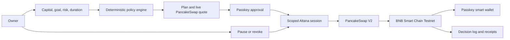

# MandateFi

> A non-custodial AI portfolio manager that can rebalance only the capital, protocols, methods, and time window its owner approves.

[](https://www.bnbchain.org/en/hackathons/smart-money-era)
[](#build-status)
[](LICENSE)

**Live product:** https://feeeeelixwong.github.io/mandatefi/

MandateFi turns a user's investment intent into a deterministic, revocable onchain mandate. The owner chooses how much capital to manage, an objective, a risk profile, and a duration. MandateFi calculates an allocation, previews the exact first action, asks for passkey approval, and then monitors the portfolio without taking custody of the owner's keys.

The current BSC Testnet MVP manages a two-asset portfolio of **tBNB and BUSD** through PancakeSwap V2. Its scope is deliberately narrow so the full product loop is inspectable and repeatable.

## The Product Loop

1. **Set capital** - choose the maximum tBNB value the mandate may manage.
2. **Choose intent** - select a goal, risk profile, and policy duration.
3. **Review the plan** - inspect target allocation, drift band, action cap, live quote, minimum output, and protocol scope.
4. **Approve once** - create or recover an Altana passkey wallet and grant an expiring session.
5. **Let the policy work** - MandateFi reads balances, evaluates drift, and submits only permitted rebalances.
6. **Stay in control** - inspect every HOLD or trade decision, pause local automation, or revoke the session onchain.

## Risk Profiles

The AI cannot invent or loosen these limits. Goal selection adjusts the stablecoin target, while the risk profile defines the execution envelope.

| Profile | Base BUSD target | Drift band | Max slippage | Max single action | Daily turnover cap |
| --- | ---: | ---: | ---: | ---: | ---: |
| Conservative | 70% | ±5% | 0.5% | 25% | 35% |
| Balanced | 45% | ±8% | 1.0% | 35% | 50% |
| Growth | 20% | ±10% | 1.5% | 45% | 70% |

`Preserve capital` adds 10 percentage points to the stable target. `Maximise growth` subtracts 10 points. Targets are clamped between 10% and 85% BUSD.

## Deterministic Decision Engine

For every check, MandateFi reads tBNB and BUSD balances plus a fresh PancakeSwap quote, reserves `0.0015 tBNB` for gas, and calculates the current stable allocation inside the owner-selected managed amount.

```text
lower bound = target stable % - drift band
upper bound = target stable % + drift band

current stable % < lower bound  -> BUY_STABLE
current stable % > upper bound  -> BUY_NATIVE
otherwise                       -> HOLD
```

Action size is the smallest of the allocation deficit or surplus, the risk profile's single-action cap, and the available balance. A trade is built only after a live quote is available, and `amountOutMin` is derived from the approved slippage limit.

Every evaluation creates an owner-visible decision record containing the inputs, rationale, projected allocation, quote, minimum output, state, and transaction link when applicable. HOLD is evidence too: it proves the policy evaluated the portfolio and intentionally did nothing.

## Two-Layer Safety Model

| Layer | Enforces | Cannot do |
| --- | --- | --- |
| Deterministic policy engine | Goal, target allocation, drift band, action size, slippage, gas reserve | Sign, broadcast, or expand authority |
| Altana session policy | Allowed contracts, allowed methods, token/native daily caps, expiry, owner revoke | Access the passkey or call an unapproved target |

The current dynamic session permits only:

- PancakeSwap V2 `swapExactETHForTokens`
- BUSD `approve`
- PancakeSwap V2 `swapExactTokensForETH`
- risk-derived daily tBNB and BUSD caps
- an owner-selected expiry

Assets remain in the passkey-controlled smart wallet. MandateFi never receives the owner's private key, and the strategy cannot modify its own mandate.

## Architecture



Primary implementation boundaries:

- `src/domain/portfolio.ts` - deterministic allocation and action sizing
- `src/integrations/altana.ts` - balances, quotes, permissions, grant, execution, and revoke
- `src/hooks/useAltanaWallet.ts` - wallet lifecycle and safe UI states
- `src/App.tsx` - onboarding, dashboard, policy, and decision-log journeys

## Public BSC Testnet Evidence

These transactions prove the passkey wallet and scoped-session lifecycle used by MandateFi:

| Evidence | Result | Explorer |
| --- | --- | --- |
| Altana smart wallet | `0x2cd25c624f1a9e75c2991db6f8636f712c38914a` | [View wallet](https://testnet.bscscan.com/address/0x2cd25c624f1a9e75c2991db6f8636f712c38914a) |
| Test-gas funding | `0.01 tBNB` confirmed | [View transaction](https://testnet.bscscan.com/tx/0xd06ce74431c7b33c1d8299e1c073f39da727fde034f56841862e103631ffc70b) |
| Passkey admin and scoped session grant | Confirmed in Altana KeyStore | [View transaction](https://testnet.bscscan.com/tx/0x726ed597395ef065e84ac93c1cbbbbadbed6680f690e77c12c86e440cdb7e263) |
| Session-key verification execution | Confirmed with zero user-call value | [View transaction](https://testnet.bscscan.com/tx/0xfd00b2341d4366840f0125ba0279c50ef0aaf8d7f522d9658332fdf14cf5dc3a) |

The dynamic two-way portfolio rebalance is implemented and testable from the product. A fresh public swap receipt for this exact build remains an operator step and is not represented here as already completed.

## Runtime Boundary

The hackathon deployment is a static browser application. A granted session signer is held only in memory, and the app evaluates the portfolio every 60 seconds while the tab is active and visible. Reloading the page intentionally discards that signer; the existing onchain grant remains revocable, but continuing automation requires a new owner-approved runtime.

A production deployment would move the same deterministic evaluator and scoped session into a secure always-on executor or enclave. It would not broaden the onchain permission set. See [the production plan](docs/INTEGRATION_PLAN.md) and [the BSC Testnet runbook](docs/ALTANA_RUNBOOK.md).

## Track Alignment

| Track | Contribution |
| --- | --- |
| Smart Money | Converts human investment intent into explainable, bounded onchain asset management |
| PancakeSwap | Uses live two-way quotes and bounded BNB/BUSD swaps with policy-derived slippage and spend caps |
| Altana integration | Uses a passkey smart wallet, scoped session methods, expiry, and owner-controlled revoke |

## Build Status

| Capability | Status |
| --- | --- |
| Capital, goal, risk, and duration onboarding | Complete |
| Deterministic BNB/BUSD portfolio planner | Complete and unit-tested |
| Live BSC Testnet tBNB/BUSD balances | Complete |
| Live PancakeSwap two-way quote and minimum output | Complete |
| Dynamic Altana method and spend permissions | Complete |
| Initial rebalance execution and decision receipt | Complete in product flow |
| Dashboard, decision log, pause, and onchain revoke | Complete |
| Responsive desktop and mobile experience | Complete |
| Public receipt for this exact dynamic build | Pending one owner-authorized Testnet run |
| Secure always-on production executor | Production milestone |

## Run Locally

```bash
npm install
npm run dev
```

Quality checks:

```bash
npm run lint
npm test
npm run build
```

## License

[MIT](LICENSE)
