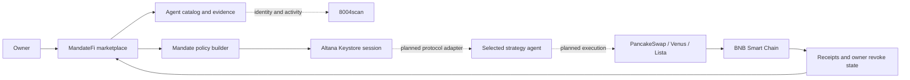

# MandateFi

> Discover, compare, and activate autonomous DeFi agents with bounded permissions.

[](https://www.bnbchain.org/en/hackathons/smart-money-era)
[](#build-status)
[](LICENSE)

MandateFi is an agent marketplace for the **BNB Chain Smart Money Era Hackathon**. It helps a user move through the full decision journey: discover an agent, understand its evidence, compare alternatives, and grant only the authority that agent needs.

**Prototype:** https://feeeeelixwong.github.io/mandatefi/

> **Data notice:** strategy outcomes remain clearly labeled scenario data. Wallet/network state and the ERC-8004 registry strip are live. The Altana passkey wallet and grant/verify/revoke runtime are implemented as user-triggered BSC Testnet operations; a funded user run is still required before publishing transaction evidence. Strategy protocol transactions remain a separate milestone.

## ✦ Product Journey

1. **Discover** agents across all four required strategy categories.
2. **Understand** outcomes, risk, cost, protocols, and safeguards.
3. **Compare** up to three agents with a consistent metric model.
4. **Activate** a public Altana session with a passkey and explicit expiry.
5. **Verify** the session through a zero-value KeyStore call on BSC Testnet.
6. **Control** active mandates from one place and revoke them onchain.

## ◫ Marketplace Coverage

| Category | User job | Example agents | Evidence model |
| --- | --- | --- | --- |
| Rebalancing | Keep LP capital productive | Range Pilot, Delta Range | Range uptime, fee uplift, drawdown |
| Grid Trading | Automate bounded grid execution | Grid Smith, Calm Grid | Net return, win rate, profit factor |
| Yield Optimisation | Route capital by net yield | Yield Scout, Carry Router | Net APY, uplift, move frequency |
| Health Factor | Prevent avoidable liquidations | Health Guard, Buffer Watch | Response time, false actions, avoided liquidations |

## ◎ Owner-Controlled Activation

Every activation is expressed as a revocable mandate:

```text
Agent identity + capital cap + contract allowlist + expiry + owner revoke
```

The current integration registers an Altana session key in the public KeyStore. Its executable scope is intentionally narrow: `isValidKey(address,bytes32)` on the configured KeyStore. The verification call transfers zero value, while the session has a native fee allowance capped at `0.003 tBNB/day` so Altana can pay for execution gas. No token or protocol spend permission is granted. This produces a safe proof of grant, session execution, expiry, and owner revoke before strategy-specific protocol adapters are enabled.

The injected wallet only funds the smart wallet with test gas. The Altana administrator is a device passkey, and neither MandateFi nor the strategy agent receives the owner's private key.

## ⑂ Architecture



See [the integration plan](docs/INTEGRATION_PLAN.md) for contract and API boundaries.

## 🏁 Track Alignment

| Track | MandateFi contribution | Proof required before submission |
| --- | --- | --- |
| Main Agent Marketplace | Four equally deep categories and a discover-to-activate journey | Live catalog data and working activation |
| Altana | Passkey-controlled smart wallet with scoped calls, gas cap, expiry, and revoke | KeyStore registration and real session-key transaction |
| TermiX | Marketplace that helps users select agents by value | Completed [Agent Advantage Report](docs/AGENT_ADVANTAGE_REPORT.md) |
| PancakeSwap | Rebalancing and grid agents tied to trader/LP outcomes | Real Testnet execution or verifiable simulation |

## Build Status

| Capability | Status |
| --- | --- |
| Four-category marketplace | ✅ Functional |
| Search, filtering, and comparison | ✅ Functional |
| Mandate setup and revoke UX | ✅ Functional |
| Responsive desktop/mobile UI | ✅ Functional |
| Injected wallet + BSC Testnet guard | ✅ Live |
| tBNB balance read | ✅ Live |
| 8004scan identity API | ✅ Live read-only |
| BNB Agent Studio agent runtime | ⏳ Next |
| Altana passkey smart wallet | ✅ Implemented |
| Altana grant, session execute, revoke | ✅ Implemented; user-triggered |
| Published BSC Testnet transaction evidence | ⏳ Funded owner run required |
| Strategy protocol execution | ⏳ Next adapter milestone |
| Advantage Report measurements | ⏳ Template ready |

The UI keeps live identity data visually separate from the simulated strategy catalog so evaluators can identify which claims are currently backed by external systems. The main boundaries are `src/hooks/useInjectedWallet.ts`, `src/services/erc8004.ts`, and `src/integrations/altana.ts`.

See the [Altana runbook](docs/ALTANA_RUNBOOK.md) for the exact user flow, transaction evidence, and security boundary.

Official references: [BNB wallet configuration](https://docs.bnbchain.org/bnb-smart-chain/developers/wallet-configuration/) and [8004scan Builder Hub](https://8004scan.io/developers).

## Run Locally

```bash
npm install
npm run dev
```

Quality checks:

```bash
npm run lint
npm run build
npm test
```

## Integration Note

The official `@bnbagent/studio-cli@0.0.12` package currently declares `commander@^15.0.0`, while that dependency is not available from the public npm registry at the time of this build. The product shell therefore stays SDK-ready and does not claim a successful CLI installation. Direct integrations can proceed while the upstream package is corrected.

## License

[MIT](LICENSE)
