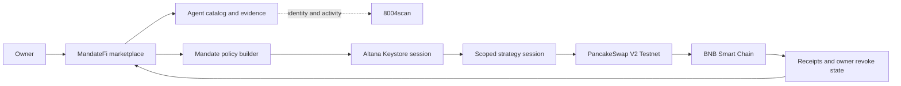

# MandateFi

> Discover, compare, and activate autonomous DeFi agents with bounded permissions.

[](https://www.bnbchain.org/en/hackathons/smart-money-era)
[](#build-status)
[](LICENSE)

MandateFi is an agent marketplace for the **BNB Chain Smart Money Era Hackathon**. It helps a user move through the full decision journey: discover an agent, understand its evidence, compare alternatives, and grant only the authority that agent needs.

**Prototype:** https://feeeeelixwong.github.io/mandatefi/

> **Data notice:** catalog performance outcomes remain clearly labeled scenario data. Wallet/network state and the ERC-8004 registry strip are live. The Altana passkey wallet, public KeyStore grant, and session-key verification have public BSC Testnet receipts. **Range Pilot now includes a real bounded PancakeSwap V2 Testnet execution path**; its first public swap receipt is the final operator step.

## ✦ Product Journey

1. **Discover** agents across all four required strategy categories.
2. **Understand** outcomes, risk, cost, protocols, and safeguards.
3. **Compare** up to three agents with a consistent metric model.
4. **Preview** a fresh Testnet quote, minimum output, deadline, and recipient.
5. **Activate** a public Altana session with a passkey and explicit expiry.
6. **Execute** Range Pilot's bounded `0.001 tBNB → BUSD` PancakeSwap action, or use a zero-value verification scope for catalog-only agents.
7. **Control** active mandates from one place and revoke them onchain.

## ◫ Marketplace Coverage

| Category | User job | Example agents | Evidence model |
| --- | --- | --- | --- |
| Rebalancing | Keep LP capital productive | Range Pilot, Delta Range | Range uptime, fee uplift, drawdown |
| Grid Trading | Automate bounded grid execution | Grid Smith, Calm Grid | Net return, win rate, profit factor |
| Yield Optimisation | Route capital by net yield | Yield Scout, Carry Router | Net APY, uplift, move frequency |
| Health Factor | Prevent avoidable liquidations | Health Guard, Buffer Watch | Response time, false actions, avoided liquidations |

## ◎ Owner-Controlled Activation

Every activation is expressed as a revocable mandate:

```text
Agent identity + capital cap + contract allowlist + expiry + owner revoke
```

MandateFi exposes two intentionally separate authority profiles:

| Profile | Onchain call scope | Value scope | Product use |
| --- | --- | --- | --- |
| **Safe Treasury Rebalance** | PancakeSwap V2 Testnet router, `swapExactETHForTokens` only | `0.004 tBNB/day` native cap; each product run sends exactly `0.001 tBNB` | Live Range Pilot execution |
| **Verification only** | Altana KeyStore, `isValidKey(address,bytes32)` only | `0.003 tBNB/day` native fee cap; user call sends zero value | Safe catalog-agent activation proof |

For Range Pilot, MandateFi reads a fresh PancakeSwap quote immediately before both review and execution, calculates `amountOutMin` at 99% of quote, uses a ten-minute deadline, pins the route to Testnet WBNB → BUSD, and sends output back to the Altana smart wallet. Altana enforces the router, method, daily native cap, and expiry onchain. The path, recipient, per-run amount, quote, and deadline are deterministically constructed by the MandateFi executor; they are not misrepresented as calldata constraints enforced by the current Altana permission schema.

The injected wallet only funds the smart wallet with test gas. The Altana administrator is a device passkey, and neither MandateFi nor the strategy agent receives the owner's private key.

### Verified BSC Testnet Run

The public evidence below was produced through the live MandateFi interface on 20 August 2026:

| Evidence | Result | Explorer |
| --- | --- | --- |
| Altana smart wallet | `0x2cd25c624f1a9e75c2991db6f8636f712c38914a` | [View wallet](https://testnet.bscscan.com/address/0x2cd25c624f1a9e75c2991db6f8636f712c38914a) |
| Test-gas funding | `0.01 tBNB` confirmed | [View transaction](https://testnet.bscscan.com/tx/0xd06ce74431c7b33c1d8299e1c073f39da727fde034f56841862e103631ffc70b) |
| Passkey admin + scoped session grant | Confirmed in Altana KeyStore | [View transaction](https://testnet.bscscan.com/tx/0x726ed597395ef065e84ac93c1cbbbbadbed6680f690e77c12c86e440cdb7e263) |
| Session-key verification execution | Confirmed, zero user-call value | [View transaction](https://testnet.bscscan.com/tx/0xfd00b2341d4366840f0125ba0279c50ef0aaf8d7f522d9658332fdf14cf5dc3a) |

An independent RPC read returns two active KeyStore entries for this wallet: the passkey-controlled root authority and a non-admin session expiring at `2026-09-19T13:16:07Z`. This matches the account's two onchain key records and proves the session is publicly verifiable rather than UI-only state.

## ⑂ Architecture



See [the integration plan](docs/INTEGRATION_PLAN.md) for contract and API boundaries.

## 🏁 Track Alignment

| Track | MandateFi contribution | Proof required before submission |
| --- | --- | --- |
| Main Agent Marketplace | Four equally deep categories and a discover-to-activate journey | Live catalog data and working activation |
| Altana | Passkey-controlled smart wallet with scoped calls, gas cap, expiry, and revoke | KeyStore registration and real session-key transaction |
| TermiX | Marketplace that helps users select agents by value | Completed [Agent Advantage Report](docs/AGENT_ADVANTAGE_REPORT.md) |
| PancakeSwap | Safe Treasury Rebalance with a fresh quote, minimum output, deadline, and bounded spend | First public Range Pilot swap receipt |

## Build Status

| Capability | Status |
| --- | --- |
| Four-category marketplace | ✅ Functional |
| Search, filtering, and comparison | ✅ Functional |
| Mandate setup and revoke UX | ✅ Functional |
| Responsive desktop/mobile UI | ✅ Functional |
| Injected wallet + BSC Testnet guard | ✅ Live |
| tBNB balance read | ✅ Live |
| 8004scan identity API | ✅ Live read-only |
| BNB Agent Studio agent runtime | ⏳ Next |
| Altana passkey smart wallet | ✅ Implemented |
| Altana grant and session execute | ✅ Verified on BSC Testnet |
| Altana owner revoke | ✅ Implemented; user-triggered |
| Published BSC Testnet transaction evidence | ✅ Public receipts linked above |
| Safe Treasury Rebalance adapter | ✅ Implemented with live PancakeSwap quote |
| First public PancakeSwap session transaction | ⏳ One user-authorized Testnet run |
| Advantage Report measurements | ⏳ Template ready |

The UI keeps live identity data visually separate from the simulated strategy catalog so evaluators can identify which claims are currently backed by external systems. The main boundaries are `src/hooks/useInjectedWallet.ts`, `src/services/erc8004.ts`, and `src/integrations/altana.ts`.

See the [Altana runbook](docs/ALTANA_RUNBOOK.md) for the exact user flow, transaction evidence, and security boundary.

Official references: [BNB wallet configuration](https://docs.bnbchain.org/bnb-smart-chain/developers/wallet-configuration/) and [8004scan Builder Hub](https://8004scan.io/developers).

## Run Locally

```bash
npm install
npm run dev
```

Quality checks:

```bash
npm run lint
npm run build
npm test
```

## Integration Note

The official `@bnbagent/studio-cli@0.0.12` package currently declares `commander@^15.0.0`, while that dependency is not available from the public npm registry at the time of this build. The product shell therefore stays SDK-ready and does not claim a successful CLI installation. Direct integrations can proceed while the upstream package is corrected.

## License

[MIT](LICENSE)
