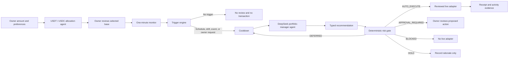

# MandateFi AI Strategy Runtime

## Why the AI layer is bounded

MandateFi separates portfolio judgment from transaction authority. An asset-management expert may recommend a typed action, but it cannot create arbitrary calldata, sign a transaction, loosen a mandate, or declare an unfinished adapter executable.

The Vercel runtime calls DeepSeek behind a server-only API key. A pre-mandate allocation agent first compares USDT and USDC. After activation, five specialist agents reason independently and a sixth portfolio-manager agent synthesizes their reports. Every model boundary has a typed deterministic fallback, so an outage cannot broaden permissions or disable the risk gate.

## Pre-mandate stablecoin allocation

The owner does not need to predict which stablecoin has the better opportunity set. After the owner manually enters the funding amount and chooses the mandate preferences, `api/strategy/stablecoin.ts`:

1. reads timestamped USDT and USDC prices from the official PancakeSwap market feed;
2. measures peg deviation for both candidates;
3. filters LP and Farm opportunities by the selected risk profile and minimum TVL;
4. compares observed APR, liquidity depth, and the count of eligible opportunities;
5. obtains both BSC Testnet tBNB normalization quotes;
6. asks a dedicated DeepSeek allocation agent for one typed choice, confidence, rationale, and key factors;
7. falls back to deterministic risk-adjusted scoring if the model is unavailable.

The output is evidence, not authority. The owner reviews the result before the Passkey signs the startup conversion, and the final session permits only that one reviewed token. Observed APR is not a forecast or guaranteed return.

## Decision pipeline

## Trigger matrix

| Trigger | Threshold in the current policy | Intended response |
| --- | --- | --- |
| Scheduled review | 4 hours, 8 hours, or daily by mandate | Re-evaluate opportunities and constraints |
| Portfolio drift | Liquid reserve outside its approved band | Typed Swap recommendation |
| LP range edge | Within 3% of a concentrated-liquidity boundary | Reposition or remove liquidity with approval |
| Impermanent loss | Above the selected profile's hard limit | Remove liquidity with approval |
| Yield decay | Approved alternative improves net yield by at least 2.5% | Prepare farm reallocation |
| Liquidity drop | Exit liquidity falls by at least 25% | Prepare an emergency unwind |
| Stablecoin depeg | At least 1% from reference | Pause and require owner review |
| Wallet cash flow | Deposit or withdrawal detected | Recompute sleeve allocations |
| Mandate expiry | Within 48 hours | Review renewal or safe unwind |
| Owner request | Manual review | Evaluate immediately |

The current live browser snapshot supplies schedule, owner, expiry, liquid-reserve drift, PancakeSwap testnet quotes, and BSC gas inputs. A Vercel market endpoint uses the official PancakeSwap Price API SDK for BNB, CAKE, USDT, and USDC prices; the Market agent requires both this mainnet snapshot and the execution-network snapshot to be fresh. A separate scheduled mainnet research snapshot supplies verified LP, Farm, and Earn opportunities. Each input has its own timestamp and freshness window; stale inputs downgrade the relevant specialist rather than being silently reused.

## Specialist agents

The committee deliberately separates research from portfolio judgment:

| Agent | Primary responsibility | Freshness window |
| --- | --- | ---: |
| Market analyst | Official Price API spot state, balances, drift and stablecoin depeg risk | 5 minutes |
| LP analyst | Pool depth, fee APR, range state and impermanent loss | 20 minutes |
| Farm analyst | Net incentives, emissions, locks and exit liquidity | 45 minutes |
| Earn analyst | Vault yield, rewards and compounding economics | 90 minutes |
| Execution cost analyst | Live gas, route slippage, price impact and exit cost | 2 minutes |

Every report has a status, stance, confidence, evidence timestamp, findings, missing inputs, and gross/risk estimates. The portfolio manager sees dissent and missing data; the deterministic gate still retains final authority.

The five roles are versioned in `src/domain/specialistPrompts.ts` as `mandatefi.specialist.v1`. Every role receives the same signed mandate and normalized portfolio context but a different scope boundary. A Market agent cannot select Farms, a Farm agent cannot invent LP telemetry, and the Cost agent cannot override the mandate ceiling.

## Research and execution boundary

The research plane runs every 15 minutes in the GitHub Pages workflow. It uses an address allowlist, official PancakeSwap Explorer data, MasterChef V3 onchain emissions, active Syrup Pool configuration, and BNB Chain RPC reads. The browser validates the generated JSON with Zod before any specialist may use it.

This build intentionally separates networks:

| Plane | Network | Purpose |
| --- | --- | --- |
| Opportunity research | BNB Chain mainnet | Rank real PancakeSwap LP, Farm, and Earn opportunities |
| Live market prices | BNB Chain mainnet | Read BNB, CAKE, USDT, and USDC USD prices through the official PancakeSwap SDK |
| Demonstration execution | BNB Smart Chain Testnet | Prove scoped Swap, CAKE/WBNB V2 LP, MasterChef V2 Farm, flexible CakePool Earn, position reads, owner unwind, session limits, and revocation |

A mainnet opportunity cannot authorize a testnet or mainnet transaction. Initial testnet deployment uses a fixed, reviewed contract registry and fresh execution-network quotes. Any recurring action must be reconstructed from a fresh execution-network snapshot, priced again, supported by a reviewed adapter, and pass the deterministic mandate gate. LP/Farm/Earn migrations remain owner-approved in this MVP.

## Expert prompt contract

`src/domain/assetManagerPrompt.ts` defines prompt version `mandatefi.asset-manager.v3`. It instructs the portfolio manager to chair independent specialist reports and optimize risk-adjusted net returns while accounting for gas, price impact, slippage, lock duration, liquidity, and impermanent loss. It also treats mainnet research as discovery evidence only, requires execution-network revalidation, and forbids interpreting annualized short-window APR as a forecast.

The response must be strict JSON containing:

- `decision`: `HOLD`, `ADJUST`, or `PAUSE`;
- `action`: one reviewed typed action;
- `confidence`: `0` to `100`;
- `rationale`: concise evidence;
- `expectedNetBenefitBps`: integer or `null`;
- `requiresApproval`: boolean.

Allowed actions are `HOLD`, `SWAP`, liquidity add/remove, farm stake/unstake, harvest, compound, emergency exit, and pause. The prompt explicitly prohibits leverage, borrowing, bridging, new protocols, unapproved assets, and arbitrary calldata.

## Risk gate

The deterministic gate checks adapter coverage after every recommendation:

| Gate result | Meaning |
| --- | --- |
| `AUTO_EXECUTE` | The typed action has a reviewed live adapter and passes cooldown and mandate checks |
| `APPROVAL_REQUIRED` | The action is supported only with an explicit owner decision |
| `DEFERRED` | A normal action is cooling down, lacks fresh cost evidence, or exceeds its execution-cost ceiling |
| `BLOCKED` | The recommendation has no live reviewed adapter |
| `HOLD` | No execution is required |

For Swap, the cost analyst combines a live BSC gas price with a conservative smart-wallet gas envelope, PancakeSwap marginal/size quote degradation, and the mandate's slippage reserve. Pool fees are already embedded in the quoted output and are not double-counted. Critical pause or emergency recommendations are never suppressed by the ordinary cooldown, but they still cannot bypass owner approval or adapter coverage.

## Vercel and DeepSeek runtime

`api/strategy/review.ts` implements the production model boundary:

1. Validate a JSON-safe mandate, strategy, portfolio snapshot, triggers, and deterministic evidence set.
2. Call five `deepseek-v4-flash` specialist agents concurrently.
3. Normalize model confidence to an integer percentage, then validate each report before merging it with deterministic data status, source, and numeric estimates.
4. Call `deepseek-v4-pro` with the five validated reports and the versioned manager prompt.
5. Validate the manager's strict JSON with `expertRecommendationSchema`.
6. Hash the complete input and record run ID, model mode, prompt version, output, and confidence in Postgres or Vercel logs.
7. Return only typed reports and a typed recommendation to the browser's deterministic gate.

The runtime never receives the owner passkey or unrestricted transaction authority. A partial specialist failure becomes `HYBRID_FALLBACK`; a manager failure uses the deterministic recommendation. Neither path skips the policy gate.

### Production model proof

On August 22, 2026, production smoke run `dead2ca4-d1c0-480f-b712-3f81d6acb99e` completed with all five specialists on `deepseek-v4-flash`, the portfolio manager on `deepseek-v4-pro`, and final `modelMode: DEEPSEEK`. The manager returned `HOLD` because fresh decision evidence was absent. That run proves the complete model path and fail-closed behavior; protocol execution evidence is recorded separately by the Swap, LP, Farm, and Earn adapter receipts.
