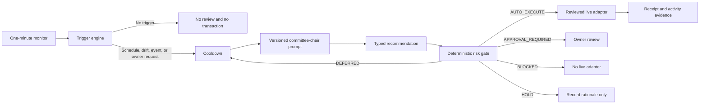

# MandateFi AI Strategy Runtime

## Why the AI layer is bounded

MandateFi separates portfolio judgment from transaction authority. An asset-management expert may recommend a typed action, but it cannot create arbitrary calldata, sign a transaction, loosen a mandate, or declare an unfinished adapter executable.

The current browser build uses a deterministic fallback decision engine that implements the same structured output contract as the production model. This makes the full trigger-to-gate workflow testable without exposing an API key in a static deployment.

## Decision pipeline

## Trigger matrix

| Trigger | Threshold in the current policy | Intended response |
| --- | --- | --- |
| Scheduled review | 4 hours, 8 hours, or daily by mandate | Re-evaluate opportunities and constraints |
| Portfolio drift | Liquid reserve outside its approved band | Typed Swap recommendation |
| LP range edge | Within 3% of a concentrated-liquidity boundary | Reposition or remove liquidity with approval |
| Impermanent loss | Above the selected profile's hard limit | Remove liquidity with approval |
| Yield decay | Approved alternative improves net yield by at least 2.5% | Prepare farm reallocation |
| Liquidity drop | Exit liquidity falls by at least 25% | Prepare an emergency unwind |
| Stablecoin depeg | At least 1% from reference | Pause and require owner review |
| Wallet cash flow | Deposit or withdrawal detected | Recompute sleeve allocations |
| Mandate expiry | Within 48 hours | Review renewal or safe unwind |
| Owner request | Manual review | Evaluate immediately |

The current live browser snapshot supplies schedule, owner, expiry, liquid-reserve drift, PancakeSwap testnet quotes, and BSC gas inputs. A separate scheduled mainnet research snapshot supplies verified LP, Farm, and Earn opportunities. Each input has its own timestamp and freshness window; stale inputs downgrade the relevant specialist rather than being silently reused.

## Specialist agents

The committee deliberately separates research from portfolio judgment:

| Agent | Primary responsibility | Freshness window |
| --- | --- | ---: |
| Market analyst | Spot state, balances, drift, volatility and depeg risk | 15 minutes |
| LP analyst | Pool depth, fee APR, range state and impermanent loss | 20 minutes |
| Farm analyst | Net incentives, emissions, locks and exit liquidity | 45 minutes |
| Earn analyst | Vault yield, rewards and compounding economics | 90 minutes |
| Execution cost analyst | Live gas, route slippage, price impact and exit cost | 2 minutes |

Every report has a status, stance, confidence, evidence timestamp, findings, missing inputs, and gross/risk estimates. The portfolio manager sees dissent and missing data; the deterministic gate still retains final authority.

## Research and execution boundary

The research plane runs every 15 minutes in the GitHub Pages workflow. It uses an address allowlist, official PancakeSwap Explorer data, MasterChef V3 onchain emissions, active Syrup Pool configuration, and BNB Chain RPC reads. The browser validates the generated JSON with Zod before any specialist may use it.

This build intentionally separates networks:

| Plane | Network | Purpose |
| --- | --- | --- |
| Opportunity research | BNB Chain mainnet | Rank real PancakeSwap LP, Farm, and Earn opportunities |
| Demonstration execution | BNB Smart Chain Testnet | Prove scoped Swap execution, gas review, session limits, and revocation |

A mainnet opportunity cannot authorize a testnet or mainnet transaction. Any executable action must be reconstructed from a fresh execution-network snapshot, priced again, supported by a reviewed adapter, and pass the deterministic mandate gate.

## Expert prompt contract

`src/domain/assetManagerPrompt.ts` defines prompt version `mandatefi.asset-manager.v3`. It instructs the portfolio manager to chair independent specialist reports and optimize risk-adjusted net returns while accounting for gas, price impact, slippage, lock duration, liquidity, and impermanent loss. It also treats mainnet research as discovery evidence only, requires execution-network revalidation, and forbids interpreting annualized short-window APR as a forecast.

The response must be strict JSON containing:

- `decision`: `HOLD`, `ADJUST`, or `PAUSE`;
- `action`: one reviewed typed action;
- `confidence`: `0` to `100`;
- `rationale`: concise evidence;
- `expectedNetBenefitBps`: integer or `null`;
- `requiresApproval`: boolean.

Allowed actions are `HOLD`, `SWAP`, liquidity add/remove, farm stake/unstake, harvest, compound, emergency exit, and pause. The prompt explicitly prohibits leverage, borrowing, bridging, new protocols, unapproved assets, and arbitrary calldata.

## Risk gate

The deterministic gate checks adapter coverage after every recommendation:

| Gate result | Meaning |
| --- | --- |
| `AUTO_EXECUTE` | The typed action has a reviewed live adapter and passes cooldown and mandate checks |
| `APPROVAL_REQUIRED` | The action is supported only with an explicit owner decision |
| `DEFERRED` | A normal action is cooling down, lacks fresh cost evidence, or exceeds its execution-cost ceiling |
| `BLOCKED` | The recommendation has no live reviewed adapter |
| `HOLD` | No execution is required |

For Swap, the cost analyst combines a live BSC gas price with a conservative smart-wallet gas envelope, PancakeSwap marginal/size quote degradation, and the mandate's slippage reserve. Pool fees are already embedded in the quoted output and are not double-counted. Critical pause or emergency recommendations are never suppressed by the ordinary cooldown, but they still cannot bypass owner approval or adapter coverage.

## Production model replacement

The deterministic fallback should be replaced behind a server-side model endpoint, not inside the static frontend. The endpoint must:

1. Receive a signed mandate version and normalized market snapshot.
2. Build the versioned prompt server-side.
3. Validate the model response with `expertRecommendationSchema`.
4. Store prompt version, input hashes, response, and confidence in the audit log.
5. Send only the typed recommendation to the deterministic gate.
6. Never receive the owner passkey or unrestricted transaction authority.
